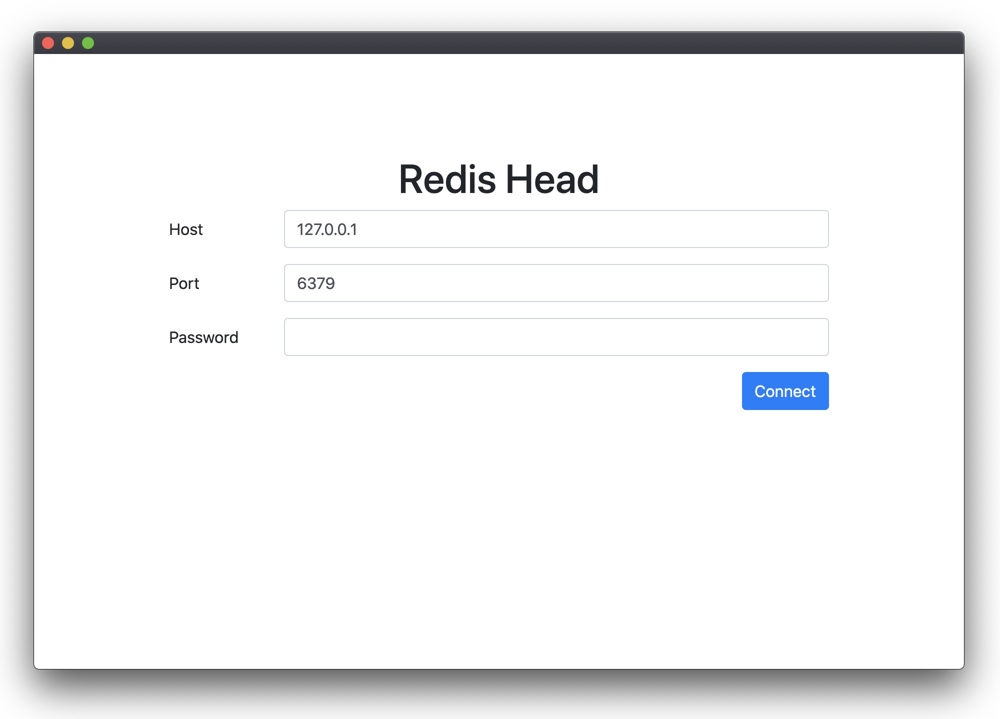

# redis-head

It is a chrome extension application for Redis.

## Installation

### Install through Chrome Web Store

## License

See [LICENSE](https://github.com/tulios/json-viewer/blob/master/LICENSE) for more details.